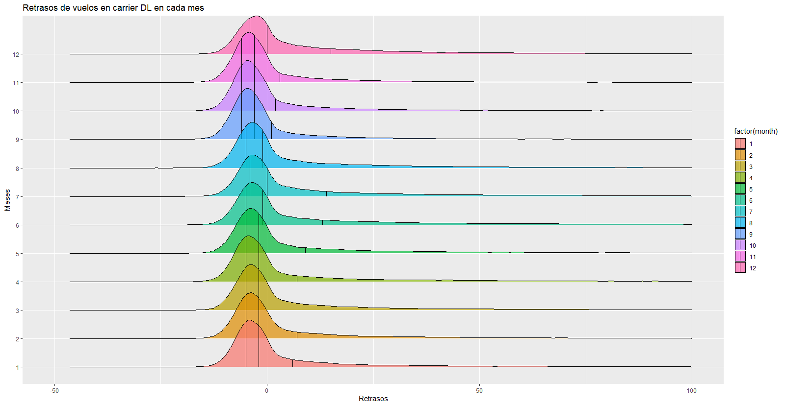

# Guía para la entrega N° 3

Análisis del dataset de vuelos de New York en 2013

## Resultado del análisis

En el aeropuerto elegido (`carrier = 'DL'`) veo que es más propenso a tener retrasos en casi todos los meses. En Julio y Diciembre, la media de sus respectivos gráficos tiende a no tener retrasos.

