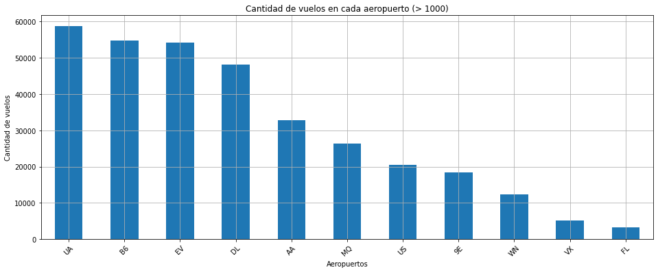
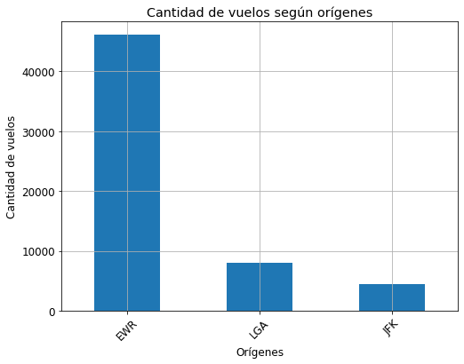
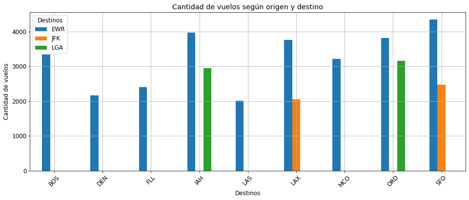
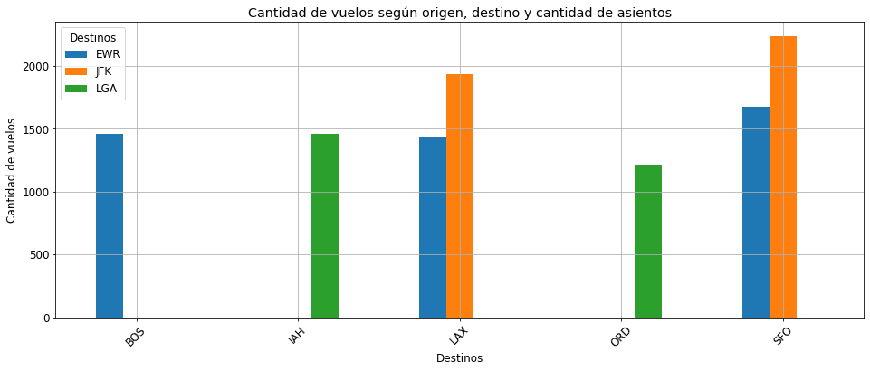

# Entrega N° 4 - Dataset Flights

- Javier Ceferino Rodriguez
- Maria Eva Ortega
- Julio Gonzalez
- Gonzalo Estevez

## Introducción

En el siguiente trabajo analizamos el dataset de vuelos con el objetivo de reforzar las trayectorias con mas demanda para lograr aumentar las ganancias y mejorar la experiencia de los pasajeros.

## Aerolínea UA (United Airlines)

A partir de lo observado en el gráfico anterior, vamos a enfocar nuestro análisis en la aerolínea (`carrier`) **United Airlines** (`UA`) ya que es la que contiene la mayor cantidad de vuelos. Sin embargo este análisis sencillamente se podría aplicar al resto de las aerolíneas de este dataset.

Como primera aproximación a nuestro objetivo, vemos la cantidad de vuelos según el orígen de cada vuelo en UA:

Vemos que tenemos los aeropuertos EWR (Aeropuerto Internacional Libertad de Newark), LGA (Aeropuerto Internacional de la Guardia) y JFK (Aeropuerto Internacional de John F. Kennedy). A simple vista EWR destaca en cantidad de vuelos, pero no es parámetro suficiente para tomar una decisión.

Ahora, sumamos los destinos como 3° variable en el gráfico:

Si bien se sigue manteniendo EWR como el aeropuerto con mayor cantidad de vuelos (con los destinos SFO, IAH y ORD), podemos sumar otra variable más si unimos el dataset de aviones (`planes`) a nuestro análisis. Vemos como variable candidata la cantidad de asientos en cada avión:

## Conclusión

En este último gráfico tenemos un mejor panoráma para tomar una decisión: JFK (con vuelos a SFO y LAX) y EWR (con vuelo a SFO) son las trayectorias con mayor demanda que elige el público. Podemos agregar un avión a cada trayectoria para mejorar tanto económicamente, como también la experiencia de usuario al momento de elegir el vuelo.