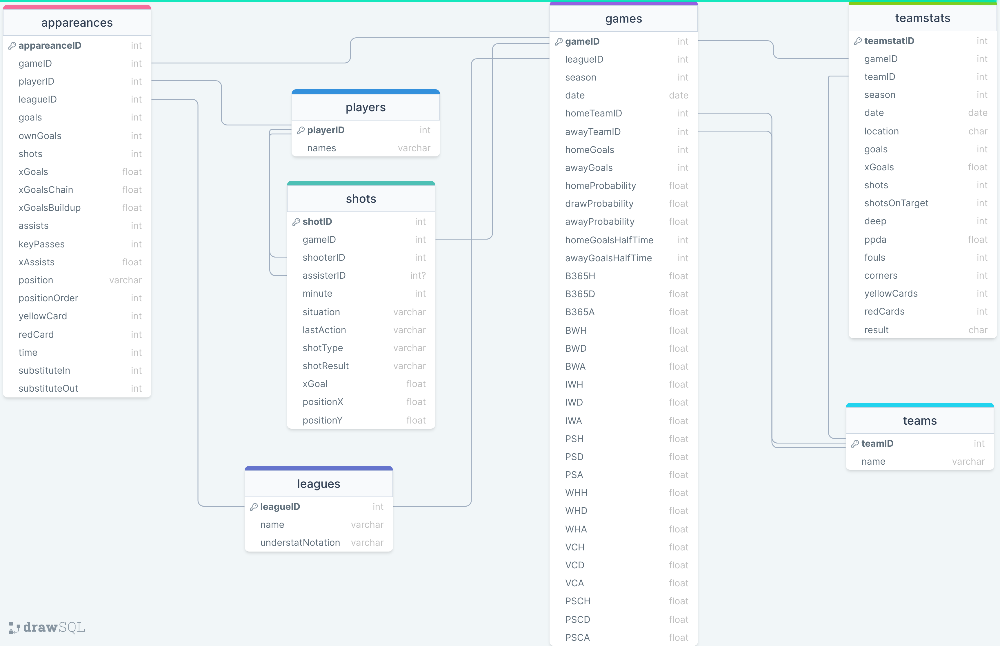
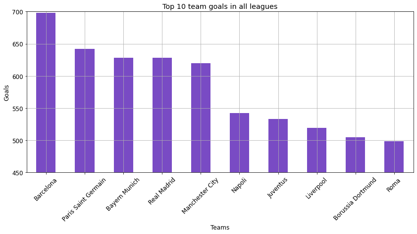
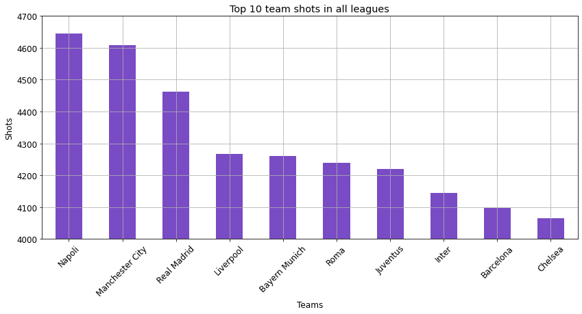
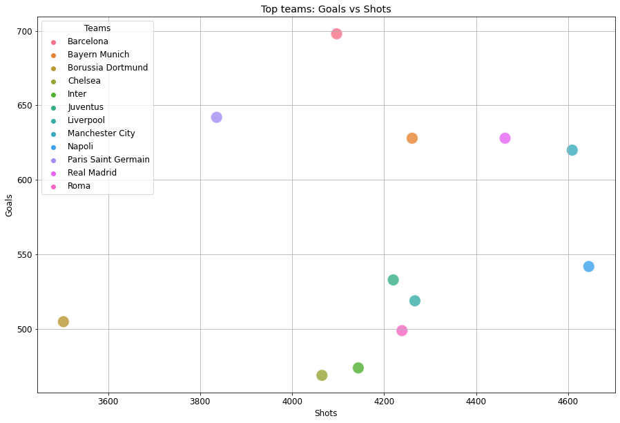
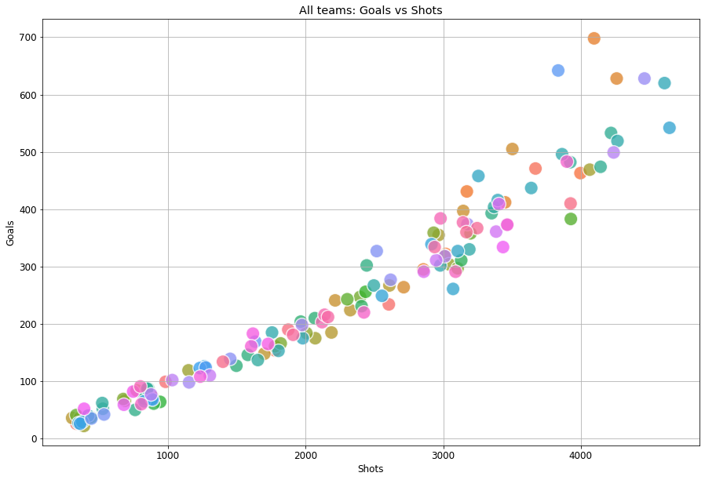
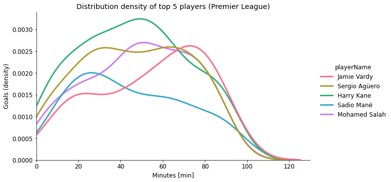

# Entrega N° 5 - Datasets de futbol

Tenemos una serie de datasets que se pueden relacionar entre sí (uno a uno, uno a muchos o muchos a uno). A nivel tabla, y agregando claves subrogadas, quedarían así:

## Trabajando con los datos relacionados

Busco los 10 equipos que más goles realizaron en las ligas europeas:

Realizamos el mismo análisis pero para los 10 equipos que más tiros al arco realizaron:

De la info obtenida, muestro en un scatter plot para observar si hay cierta tendencia:

Con solo tener una pequeña selección de equipos, no es clara si hay cierta tendencia. Para esto, ingreso todos los equipos:

Al parecer, hay una tendencia linealmente proporcional entre el número de tiros al arco y el número de goles. Es más densa la proporción entre 0 y 2500 tiros, pero luego se nota como se dispersa fuera de este rango.

Ahora, trabajo sobre una liga europea. En mi caso elijo la Premier League... Por qué? no hay por qué.

De la Premier League, me interesa saber la relación entre la cantidad de goles y en qué minuto del partido de los jugadores. Elijo a los mejores 5 goleadores y realizo un gráfico de distribución (densidad):

Harry Kane es notoriamente el mejor goleador de la Premier League, si vemos solamente la cantidad. Hasta el minuto 70 aproximádamente, mantiene el top 1 en goles. Luego del minuto 70, destaca Jamie Vardy.

Por otro lado, hay que destacar que Sergio Aguero mantiene la probabilidad de gol "casi constante" a lo largo del partido.

---

_Código, imágenes y datasets en [este repositorio](https://github.com/JaviCeRodriguez/Intro_Ciencia_Datos/tree/main/Entregas/Entrega5)._