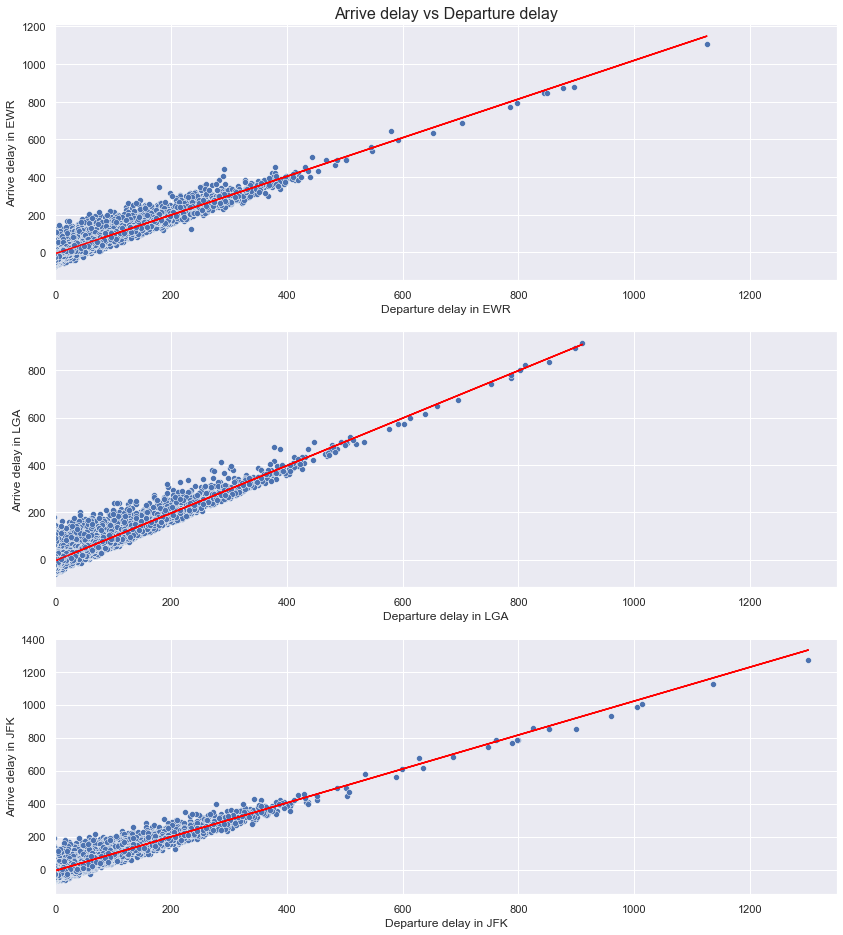
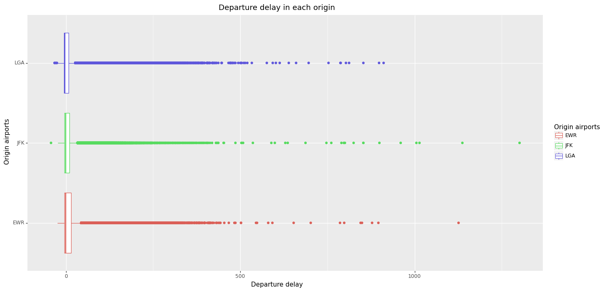
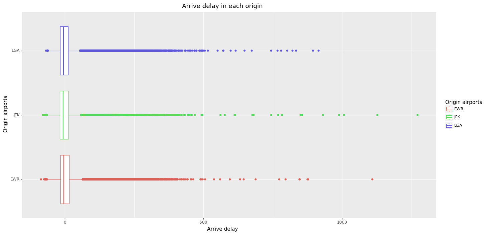
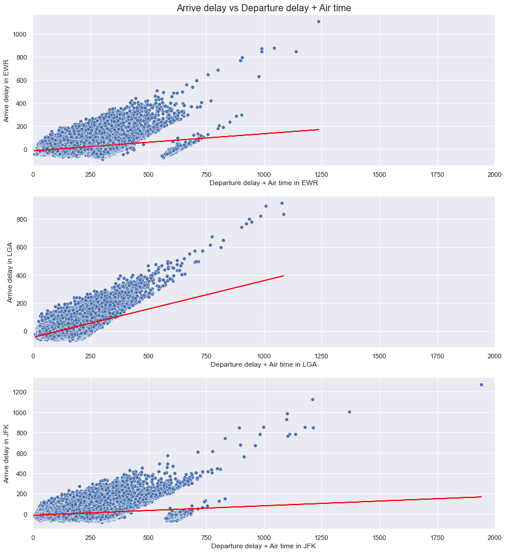
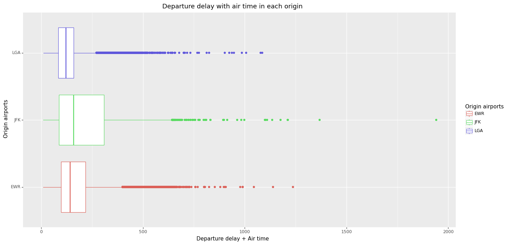

# Entrega N° 6 - Confounders: dataset flights

En esta entrega, se quiere lograr detectar variables que confundan en el análisis de nuestro dataset. Este tipo de variables se las conoce como Confounders. A continuación se realizan dos análisis distintos para poder identificar esta variable.

## Análisis y desarrollo

- Primero observamos los datos de vuelos y hago una limpieza previa de valores nulos (NaN).

- Realizando el ploteo de vuelos entre arr_delay y dep_delay, observo cierta proporcionalidad lineal. A este conjunto de datos de aplico regresión lineal, separo por origen de vuelo y se ve lo siguiente:

- Hay cierto paralelismo entre las tres pendientes rojas.

- Quiero sacar una primera conclusión a partir de un par de boxplots:

- El origen LGA tiene una leve diferencia a favor en cuanto a los atrasos, tanto en arrivo como en despegue de cada uno de los vuelos.

- Ahora, pesando: ¿existe relación con otra variable del dataset, que "no" pueda explicar tal comportamiento? En otros términos, ¿existe algun confounder? Respondiendo esto, sumo al análisis la columna air_time.

- A primera vista, ya se ve que se dispersan más los puntos en cada gráfico y la regresión lineal para cada origen cambia bastante (las pendientes entre sí pierden el comportamiento paralelo que se ve en el primer gráfico).

- Como la distribución en el 4to gráfico cambia, es esperado que el boxplot (para el eje x) cambie también:

## Conclusión

El tiempo en el aire de cada vuelo, demuestra que no es un buen indicador que explique la tendencia lineal de los atrasos

---

_Código, imágenes y dataset en [este repositorio](https://github.com/JaviCeRodriguez/Intro_Ciencia_Datos/tree/main/Entregas/Entrega6)._