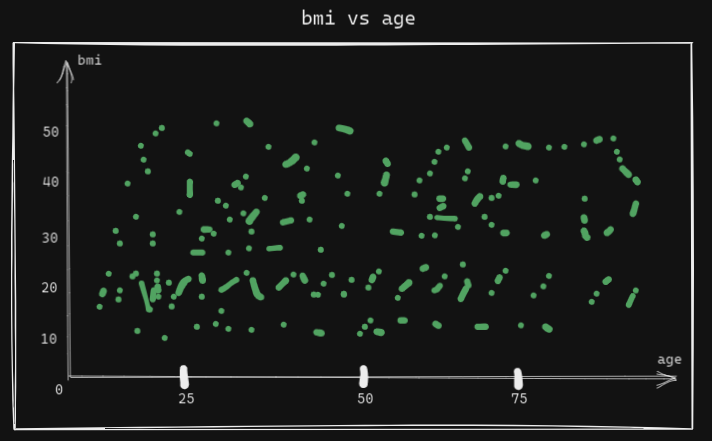
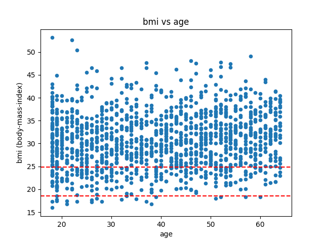
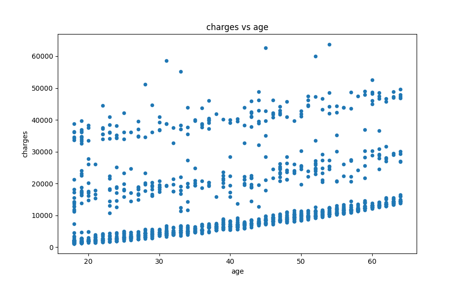
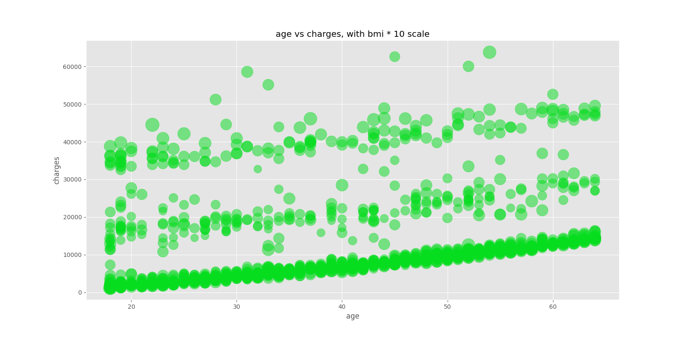
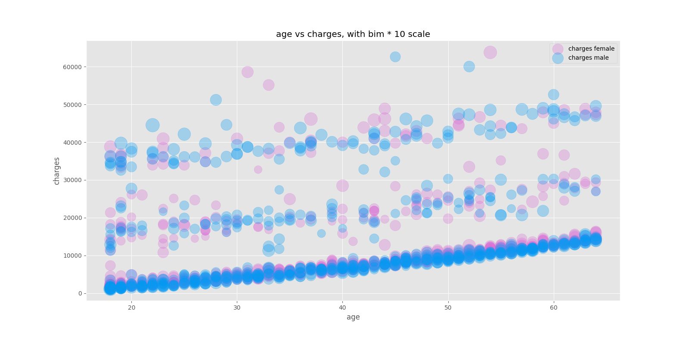
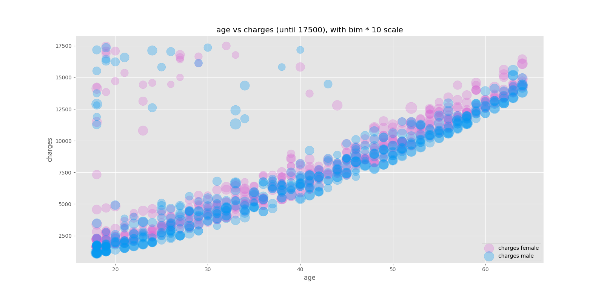

# Guía para la entrega N° 1

Análisis dataset insurance

## Consigna 1 

> ¿Cuántas variables tiene el dataset? ¿Cuántos datos?

- Número de datos (filas): 1338

- Número de variables (columnas): 7

## Consigna 2

> ¿Qué variables se podrían usar para hacer un scatter plot? ¿Cómo se imaginan que va a resultar el gráfico en cada caso? Hagan el esquema en papel y lápiz.

Si tomamos de referencia el rango ideal de bmi (18,5 a 24,9), desde un scatter plot podríamos ver que hay personas que respetarían están entre estos valores ideales. Sin conocer todos los datos, van a existir personas que están por fuera del rango y es probable que la mayoría de estos estén por encima del máximo bmi.

## Consigna 3

> Realizar alguno de los gráficos que pensaron en el punto 3. ¿Qué resultados obtuvieron? ¿Resultó como se habían imaginado? ¿Por qué?

El resultado del plot resultó ser parcialmente el esperado. Tenía en mente que iban a ser más pacientes dentro del rango ideal de bmi.

> a. ¿Cómo mejorarían el gráfico?

Sería interesante utilizar alguna variable categórica como el género para ver la densidad (o sea, observar si existe cierta tendencia).

> b. ¿Es necesario ajustar los límites de los ejes para poder apreciar mejor la relación?

No, con este gráfico (yo) puedo entender bien y sacar ciertas conclusiones.

> c. ¿Hay algún/algunos puntos que sobresale o que les llame la atención?

Hay algunos puntos bastante alejados del resto, que me generan cierta curiosidad por saber la veracidad de esta información. Los puntos que menciono están por encima de los 50 bmi (3 siendo exactos).

## Consigna 4

> Volver a realizar el punto 4 para otros pares de variables.

- Gastos (charges) vs Edad (age)

> a. De todos los gráficos que fueron haciendo ¿Cuál transmite más información? ¿Identifican algún comportamiento llamativo? ¿Cuál es más claro?

El más claro y más "deducible" es el de `charges vs age`. Hay rangos de gastos claros según la edad que parecieran ser por planes médicos y/o según la enfermedad.

## Consigna 5

> Elegir uno de los scatter plots realizados en el punto anterior al que le agregaremos una “tercera dimensión” utilizando un bubble chart (ver Cápsula 1). Elegir esa variable de tal manera que se pueda aprovechar la nueva información que están sumando al gráfico.

Uso el gráfico de `charges vs age`, agregando el `bmi` con una escala de x10 para observar mejor las burbujas.

## Consigna 6

> Sumarle al gráfico anterior la información de alguna variable categórica en forma de color. Pensar cuál y por qué.

Elijo el género para poder tener un mejor panorama de los gastos médicos y ver si hay cierta equidad.

## Consigna 7

> Entendamos si nuestra producción está lista:
> a. ¿Qué sería necesario agregar o cambiar para que el gráfico se pueda presentar a alguien que no conozca el dataset? ¿Podrían, por ejemplo, presentárselo a estudiantes de otras materias que estén estudiando en el pasillo, o a algún familiar o amigx que esté con ustedes mientras terminan el trabajo, sin explicarles previamente nada del dataset? Si no es así, ¿qué le cambiarían? Realicen esos cambios.

Se lo mostré a mi mamá pero no entendió muy bien las burbujas condensadas entre 0 y 20000 de gastos médicos.

> b. ¡Pongamos a prueba el punto anterior! Muéstrenle el gráfico a alguna persona, puede ser física o virtualmente. Registren la experiencia: ¿qué preguntas y devoluciones recibieron? ¿Hay alguna forma de resolver esas inquietudes en el mismo gráfico? Si es así, ¡háganlo!

Acá hay mayor claridad de lo que sucede en este rango de `charges`, y se ve una leve diferencia entre los gastos para pacientes femeninos (mayor a la mayoría de los pacientes masculinos).

Se lo volví a presentar a mi mamá y entendió mejor el gráfico, aunque creo que el gráfico podría ser mejor si tuviera en cuenta otras variables como `smoker` y/o `children`, para tener mejor contexto entre los distintos rangos de gastos vistos en el anterior gráfico.