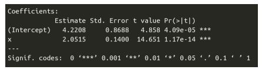
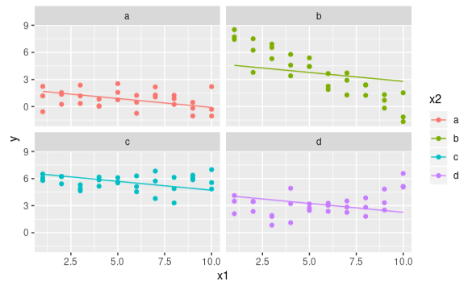

# Entrega N° 6 - Modelo lineal

Integrantes:
- Ulrich Marcelo
- Anelis Prediger
- Rodriguez Javier

## Tarea 1: Tests estadísticos

Usamos la librería modelr para utilizar datos simulados (`sim1`). Realizamos el ajuste lineal con `lm`, calculamos predicciones y las graficamos:

Calculamos los residuos y graficamos

Exploramos los gráficos de `plot(model)` para ver:

- Los datos fiteados vs los residuos

- Normal Q-Q

- Scale Location

- Residuos vs Leverage

Aplicamos `summary` y obtenemos los coeficientes:

Agregamos ruido a los valores de y con `rnorm`, agregando la media de y. Graficamos:

## Tarea 2: Términos de interacción

En esta tarea usamos `sim3` para entender los términos de interacción con el modelo lineal.

Tenemos dos variables categóricas `x2` y `rep` y el resto (`x1`, `y` y `sd`) son continua.

Realizamos un scatter plot para visualizar todos los datos y variables del dataset:

Vemos la diferencia entre fórmula de suma y producto. En las tablas vemos el resultado de utilizar las variables categóricas. Corresponden a los valores de cada término de la fórmula.

Ahora, ajustamos ambos modelos y lo primero que observamos en las tablas es que las predicciones tienen distintos comportamientos. Si lo graficamos:

- Para suma:

- Para producto:

Claramente, el segundo modelo que es por producto se ajusta mejor a nuestro dataset

Ejemplos de casos de uso para estos modelos:

- Diámetro de árboles según especies o comuna
- Seguros para géneros, fumadores o no

## Tarea 3: Transformación de variables

Importamos el dataset de diamantes y usamos las variables `carat` y `price`.

El corte del diamante claramente varía el precio y kilates. Nos animamos a ver con otra variable `clarity`:

Realizamos las predicciones para `cut` y vemos los resultados en el siguiente gráfico:

Calculamos los residuos y graficamos vs predicciones:

Vemos que los residuos de los datos decaen a medida que aumenta la relación entre `price` y `carat`.

En un nuevo modelo, proponemos utilizar `clarity`, `cut` y `color`. Filtramos los datos para el mejor diamante (según dataset).

Para finalizar la tarea 3, aplicamos un modelo logarítmico, observamos sus residuos y la media:

- Modelo logarítmico:

- Media de residuos:

## Tarea 4: Confounders y modelo causal

Hacemos un gráfico de cajas para evaluar la dependencia del corte en el precio de los diamantes:

